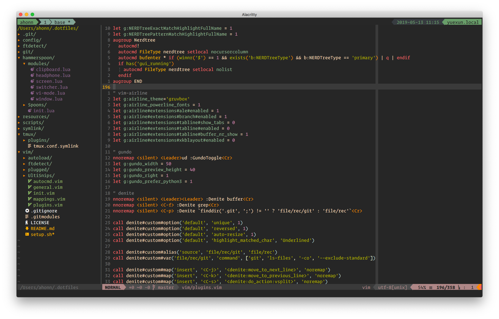

# dotfiles
My vim/neovim, nix, git, and tmux configuration files



## Install
```
$ sh <(curl -L https://nixos.org/nix/install)
$ nix-build https://github.com/LnL7/nix-darwin/archive/master.tar.gz -A installer
$ ./result/bin/darwin-installer
$ mkdir .config && git clone git@github.com:ahonn/dotfiles.git ~/.config/nix-drawin
$ nix --extra-experimental-features 'nix-command flakes' run nix-darwin -- switch --flake ~/.config/nix-darwin#macos
```
